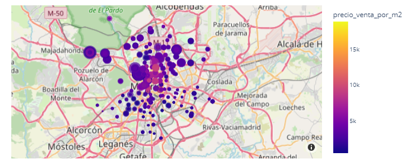

# EDA_Viviendas_Madrid

#### Maria del Rosario Ortiz
15/12/23

Este es un trabajo de investigación de datos sobre viviendas de Madrid. El objetivo es analizar como se ve afectado el precio por metros cuadrados (€/m2) de una vivienda en Madrid, según distintas variables o características propias de las viviendas como:

- Zona
- Nº de habitaciones
- Balcón/Terraza
- Baños
- Trastero
- Estacionamiento
- Certificado energético

Los datos utilizados se obtuvieros de [Link Dataset](https://www.kaggle.com/datasets/mirbektoktogaraev/madrid-real-estate-market), que 

#### Contiene información relativa a:

- annio_construccion: año de construcción del inmueble
- precio_venta: Valor de la inmueble
- precio_venta_por_m2: valor de la inmueble por metro cuadrado
- cee: certificado energértico del inmueble
- piso: planta a la que se encuentra
- balcon: si tiene o no tiene balcón
- armarios_empotrados: si tiene o no tiene armarios empotrados
- jardin: si tiene o no tiene jardín
- zonas_verdes: si tiene o no tiene zonas verdes
- estacionamiento: si tiene o no tiene estacionamiento
- pileta: si tiene o no tiene pileta
- trastero: si tiene o no tiene trastero
- terraza: si tiene o no tiene terraza
- tipo_inmueble: si es un piso, un duplex, chalet o ático
- accesible: si es o no accesible para personas con movilidad reducida
- exterior: si tiene o no tiene exterior
- bajo: si es o no es un piso en planta baja
- necesita_reforma: si la vivienda necesita o no necesita reforma
- bannos: cantidad de baños del inmueble
- habitaciones: cantidad de habitaciones del inmueble
- metros_cuadrados: cuantos metros cuadrados tiene el inmueble
- ubicacion: donde se ubica geográficamente el inmueble

#### Métodos:

Mediante métodos gráficos y estadisticos se analiza la relación entre la variable principal (precio_venta_por_m2) contra las demás variables del dataset

#### Resultados hacia futuro:
Después de analizar las variables que más afectan al precio por metro cuadrado de una vivienda se puede predecir el mismo para realizar una venta o nos puede dar una visión previa a la hora de realizar la tasación de un inmueble.

> Mapa que muestra el precio por metro cuadrado y el tamaño de las viviendas

